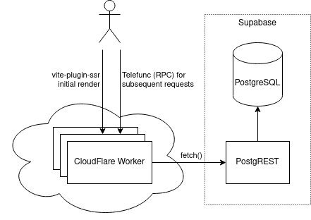

# Infrad

Infrad is a web-based application that enables people wanting to increase the livability of their cities and towns. Ideas, initiatives and concerns can be interchanged and discussed. Changes and progress can be transparantly shared and tracked.

If you are interested in what is currently being worked on, and what will be next, check out the [Trello board](https://trello.com/b/eNd1jl6u/infrad).

## Developers

Infrad is written in TypeScript.

The **frontend** consists of React and [UnoCSS](https://github.com/unocss/unocss).

A [serverless](https://en.wikipedia.org/wiki/Serverless_computing) **backend** is used (meaning there are no specific servers that need to be managed). In particular, the main backend is deployed to [CloudFlare Workers](https://workers.cloudflare.com/), with [vite-plugin-ssr](https://vite-plugin-ssr.com/) handling SSR and [Telefunc](https://telefunc.com/) handling RPC calls. PostgreSQL is used as a database, with [PostgREST](https://postgrest.org/en/stable/) as an intermediary since arbitrary TCP connections are not possible from Cloudflare Workers (also it does connection pooling).

A diagram of this architecture (if you can call it that) can be found below. The main motivation was development speed, not scalability or architectural soundness. Nevertheless, it will be interesting to learn about the limitations and strenghts. 

You need to use `docker-compose up` to run PostgreSQL and PostgREST locally. Then you can run `npm run dev` to run the dev server.

## See Also

- [Veilig Verkeer Nederland Participatiepunt](https://participatiepunt.vvn.nl/) (the Netherlands)
- [Cyclestreets](https://www.cyclestreets.net/photomap/) (United Kingdom)
- [Cyclescape](https://www.cyclescape.org/) (United Kingdom)
- [DansMaRue](https://play.google.com/store/apps/details?id=fr.paris.android.signalement&hl=en&gl=US) (Paris, France)